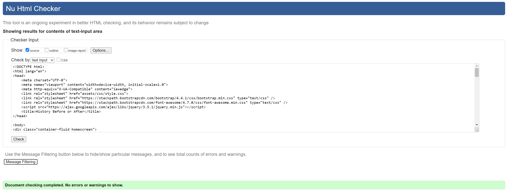
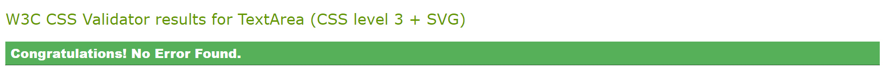

[Picture of deployed project ](https://github.com/whatnote/ms2historybeforeorafter/blob/master/assets/WriteUpPics/historyBeoreOrAfter.png)

# [History Before or After](https://whatnote.github.io/ms2historybeforeorafter/) - Milestone Project Two

## Table of Contents

- [**About**](#About)
- [**UX**](#UX)
  - [User Stories](#User-Stories)
  - [Research](#Research)
  - [Style Rationale](#Style-Rationale)
  - [Wireframes](#Wireframes)
- [**Features**](#Features)
  - [Functionality](#Functionality)
  - [Existing Features](#Existing-Features)
    - [Game Controls](#Game-Controls)
  - [Features Left To Implement](#Features-Left-To-Implement)
- [**Technologies Used**](#Technologies-Used)
  - [Version Control](#Version-Control)
- [**Testing**](#Testing)
  - [Testing User Stories](#Testing-User-Stories)
  - [Responsive Testing](#Responsive-Testing)
  - [Additional Testing](#Additional-Testing)
  - [HTML And CSS Validation](#HTML-And-CSS-Validation)
  - [Interesting Bugs Or Problems](#Interesting-Bugs-Or-Problems)
- [**Deployment**](#Deployment)
  - [Running Code Locally](#Running-Code-Locally)
- [**Credits**](#Credits)
  - [Content](#Content)
  - [Media](#Media)
    - [Pictures](#Pictures)
  - [Acknowledgements](#Acknowledgements)
  - [Disclaimer](#Disclaimer)

## About

This game is aimed at anyone who has an interest in History. The pub quizzer, child, parent, someone who wants to learn about history.
It’s a spin on the classic card game higher or lower; A fun way approach learning about history, you can just play the game; did a historical event happen before or after the preceding card. You can use your knowledge or just guess the year of the event.
If the player wants to, they can then click for more info, where a short paragraph explains the event, additionally click the link to a website that discusses the event in much greater detail

## UX

### User Stories

- I want a play button.
- I want a large deck of cards.
- I’d prefer not to have numerous war events.
- I want the draw to be random.
- I want short snappy game, no more than 10 cards in normal mode.
- I want levels of difficulty.
- I want more than just the year of the event, more info and more information.
- I want a play again button.
- I want a scoreboard.
- I want to be able to request a new card.

### Research

This game is derived from the card game, higher or lower. I replaced the playing cards with history cards.
I looked at several higher or lower games via youtube and the wider web and almost all didn’t use playing cards, just numbers. I did find an Udemy course, that showed you how to make a high lower claim game using JavaScript. I found this invaluable as it showed you how to construct many of the elements needed to make the game.

- In particular:
  - The shuffle
  - Scoring system
  - Scoring system
  - Number of turns.

A link to this course can be found [here](https://www.udemy.com/course/javascript-card-game/).

### Style Rationale

I wanted the game to resemble a deck of card and the appearance to look old, as if the cards have been used. With this I opted for a slightly of white colour for the background of the cards.
The text also had to look historical, the typewriter font helped finish off the look of the game.
The next step I wanted cards to rotate to reveal their information, I also wanted the additional historical to appear after the questions are answered.

### Wireframes

[Desktop Wireframe ](https://github.com/whatnote/ms2historybeforeorafter/blob/master/assets/wireframes/desktophistoryhigherorlower.pdf)

[Mobile Wireframe](https://github.com/whatnote/ms2historybeforeorafter/blob/master/assets/wireframes/Mobile%20History-higher%20or%20lower.pdf)

## Features

### Existing-Features

- Deal button
- Deals 10 cards at random from a deck of 42 cards.
- Each card contains:
  - A name of event
  - A Picture of the event.
  - Year of Event
  - A more info button on each card, provides a short paragraph about the historical event.
  - In addition to the more info card a link to a website describes the event in even more detail.
- A Score bored
- Compare your score against a benchmark of score

### Game-Controls

- home screen - this expains the game and how to play it.
- A Play Button - Stars the game.
- A Before of After button - These are your game controlers, pick the correct asswer and you'll score a point.
- A scoreboard - Points are logged here.
- A more info button - on the reveal card addation infomation is available about the event.
- A link for additional information - If you want to read even more about the subject this will take you to a link.
- A play again button - Take yuou back to the start of the game.

### Features-Left-To-Implement

- Levels of play
  - Hard
  - Medium
  - Easy

## Technologies-Used

[**Trello**](https://trello.com/)

- Used to time manage the various steps in the project.

[**Balsamiq**](https://balsamiq.com/)

- Balsamiq was used to create wireframes of both the mobile and website before construction began.

[**Gitpod**](https://gitpod.io/)

- I used Gitpod to write my code.

[**Git**](https://git-scm.com/)

- I've used Git version control system to regularly add and commit changes made to project in gitpod thn pushing them to GitHub.

[**Google Fonts**](https://fonts.google.com/)

- I used google fonts to style the text.

[**Bootstrap**](https://getbootstrap.com/)

- I've used bootstrap to to assist with my layout. I've then used CSS to style same.

[**HTML**](https://developer.mozilla.org/en-US/docs/Web/Guide/HTML/HTML5)

- HTML is used to create the landing page for my game.

[**CSS**](https://developer.mozilla.org/en-US/docs/Web/CSS/CSS3)

- The project uses CSS to apply style to my site. The style.css is link to the index.html.

[**JavaScript**](https://www.javascript.com/)

- The main focus of this project. script.js is linked to the index.html file.

[**jQuery**](https://jquery.com)

- I use jQueryt for DOM manipulation in my project.

## Version Control

[**Git**](https://git-scm.com/)

- Git was used to regularly commit changes made to my project.

[**GitHub**](https://github.com/)

- Is used as my Repository.

Testing
In this section, you need to convince the assessor that you have conducted enough testing to legitimately believe that the site works well. Essentially, in this part you will want to
go over all of your user stories from the UX section and ensure that they all work as intended, with the project providing an easy and straightforward way for the users to achieve their goals.

Whenever it is feasible, prefer to automate your tests, and if you've done so, provide a brief explanation of your approach, link to the test file(s) and explain how to run them.

For any scenarios that have not been automated, test the user stories manually and provide as much detail as is relevant. A particularly useful form for describing your testing process is via scenarios, such as:

Contact form:
Go to the "Contact Us" page
Try to submit the empty form and verify that an error message about the required fields appears
Try to submit the form with an invalid email address and verify that a relevant error message appears
Try to submit the form with all inputs valid and verify that a success message appears.
In addition, you should mention in this section how your project looks and works on different browsers and screen sizes.

You should also mention in this section any interesting bugs or problems you discovered during your testing, even if you haven't addressed them yet.

If this section grows too long, you may want to split it off into a separate file and link to it from here.

## Testing

### Testing-User-Stories

### Responsive-Testing

### Additional-Testing

### HTML-And-CSS-Validation

I used the website, https://validator.w3.org/#validate_by_input, to check my html code, when testing 4 minor errors were noted. 2 of them were not closed a /div once that was closed 2 errors were resolved. The other two erros were generated by a some id being used twiced, once this was resolved all the errors were gone.

I used the website. https://jigsaw.w3.org/css-validator/, to check the code for my CSS, fortunatley it showed no errors.

### Interesting-Bugs-Or-Problems

Not a bug, as such but something that took me far too long to work out!

## Deployment

### Repository Link

To run the game in a live environment [click here](https://whatnote.github.io/ms2historybeforeorafter/)

The link to my repository can be found via this link:
[Link to Repository](https://github.com/whatnote/ms2historybeforeorafter)

### Running-Code-Locally

### Credits

### Content

- Most of the code was written by me, wher it's noot I've commented the url by the borrowed section of code.

- As mentioned above I did find an Udemy course, that showed you how to make a high lower claim game using JavaScript. I found this invaluable as it showed you how to construct many of the elements needed to make the game.

* In particular:

  - The shuffle
  - Scoring system
  - Scoring system
  - Number of turns.

  A link to this course can be found [here](https://www.udemy.com/course/javascript-card-game/).

- The game is clearly not an oringal idea but I would like to think my twist on it using historical events is.

### Media

#### Pictures

[The Great Fire of London.](https://en.wikipedia.org/wiki/Great_Fire_of_London)

[Florence Nightingale born.](https://www.britannica.com/biography/Florence-Nightingale)

[When was the first Crufts dog Show](https://en.wikipedia.org/wiki/Crufts)

[Charles Darwin’s theory of evolution was published](https://en.wikipedia.org/wiki/On_the_Origin_of_Species)

[The Postal Service Opened](https://en.wikipedia.org/wiki/Royal_Mail#:~:text=One%20of%20his%20first%20acts,being%20paid%20by%20the%20recipient)

[The London Stock Exchange is opened.](https://en.wikipedia.org/wiki/London_Stock_Exchange)

['The London underground Open.](https://en.wikipedia.org/wiki/London_Underground)
[The launch of the Titanic](https://en.wikipedia.org/wiki/RMS_Titanic)

[First female MP to sit in the UK parliament.](https://www.parliament.uk/about/living-heritage/transformingsociety/electionsvoting/womenvote/overview/womenincommons/')

[Women received the same voting rights as men.](https://www.parliament.uk/about/living-heritage/transformingsociety/electionsvoting/womenvote/case-study-the-right-to-vote/the-right-to-vote/birmingham-and-the-equal-franchise/1928-equal-franchise-act/1928-equal-franchise-act-first-page/')

[The Potato is brought to Britain.](https://en.wikipedia.org/wiki/History_of_the_potato)

[Tea is first brought to the England](https://www.tea.co.uk/history-of-tea)

[England wins the Football World Cup.](https://en.wikipedia.org/wiki/1966_FIFA_World_Cup)

[The National Trust is founded.](https://www.nationaltrust.org.uk/lists/our-history-1884-1945nk)

[Britains first Nuclear Power station is built.](https://en.wikipedia.org/wiki/Nuclear_power_in_the_United_Kingdom#:~:text=The%20United%20Kingdom%20established%20the,was%20generated%20from%20nuclear%20power.)

[The first Official Grand National.](https://en.wikipedia.org/wiki/1839_Grand_National#:~:text=The%201839%20Grand%20Liverpool%20Steeplechase,a%20field%20of%2017%20runners.',)

[The BBC is founded.](https://www.bbc.com/historyofthebbc/timelines/1920s)

[The 999 emergency number is introduced.](<https://en.wikipedia.org/wiki/999_(emergency_telephone_number)#:~:text=First%20introduced%20in%20the%20London,which%20five%20women%20were%20killed.>)

[The first Harry Potter book is published.](https://en.wikipedia.org/wiki/Harry_Potter)

[The first UK Motorway is completed.](https://en.wikipedia.org/wiki/M1_motorway#:~:text=The%20first%20section%20of%20motorway,motorway%20and%20opened%20in%201959.)

[The British Museum opens.](https://www.britishmuseum.org/about-us/british-museum-story)

[The first English Parliament is Held.](https://en.wikipedia.org/wiki/Parliament_of_England)

[The Black Death (1st one).](https://en.wikipedia.org/wiki/Black_Death_in_England)

[The Signing of the Magna Carta.](<https://en.wikipedia.org/wiki/Magna_Carta#:~:text=Magna%20Carta%20Libertatum%20(Medieval%20Latin,Windsor,%20on%2015%20June%201215)>)

[Westminster Abbey is completed.](https://en.wikipedia.org/wiki/Westminster_Abbey#:~:text=It%20was%20the%20first%20church,Edith%20was%20buried%20alongside%20him.)

[The first printing press in Britain opens.](<https://en.wikipedia.org/wiki/William_Caxton#:~:text=William%20Caxton%20(c.,English%20retailer%20of%20printed%20books.)>)

[The Domesday Book is completed.](<https://en.wikipedia.org/wiki/Domesday_Book#:~:text=Domesday%20Book%20(%2F%CB%88du%CB%90,of%20King%20William%20the%20Conqueror.)>)

[The building of Hadrian’s walll begins.](https://www.english-heritage.org.uk/visit/places/hadrians-wall/hadrians-wall-history-and-stories/history/#:~:text=It%20was%20built%20by%20the,on%2DSolway%20in%20the%20west.)

[William Shakespear is born.](https://en.wikipedia.org/wiki/William_Shakespeareink)

[Income Tax is Introduced.](https://www.politics.co.uk/reference/income-tax#:~:text=Income%20Tax%20rose%20dramatically%20in,%22Super%20Tax%22%20was%20introduced.)

[Britians First satellite is Launched.](<https://en.wikipedia.org/wiki/Prospero_(satellite)#:~:text=Although%20Prospero%20was%20the%20first,1962%20on%20a%20U.S.%20rocket.>)

[Compulsory driving test is introduced.](https://en.wikipedia.org/wiki/United_Kingdom_driving_test#:~:text=Legislation%20for%20compulsory%20testing%20was,to%20have%20passed%20the%20test.)

[The London Olympics (modern).](https://en.wikipedia.org/wiki/2012_Summer_Olympics)

[The Queen’s first televised Christmas speech.](https://en.wikipedia.org/wiki/Royal_Christmas_Message)

[The first Briton in Space.](https://www.fourpure.com/blog/helen-sharman-the-first-brit-in-space#:~:text=Take%20Helen%20Sharman%2C%20a%2026,wanted%2C%20no%20experience%20necessary.%E2%80%9D)

[The channel Tunnel opens.](https://en.wikipedia.org/wiki/Channel_Tunnel)

[Britain Joins EEC.](https://en.wikipedia.org/wiki/Accession_of_the_United_Kingdom_to_the_European_Communities)

[Decimalisation of British Currency.](https://www.bbc.co.uk/news/business-12346083#:~:text=If%20you%20do%2C%20you%20must,20%20shillings%20to%20the%20pound.)

[The Gunpowder Plot.](https://en.wikipedia.org/wiki/Gunpowder_Plot)

[Captain Scotts Expedition reaches the South Pole.](https://en.wikipedia.org/wiki/Robert_Falcon_Scott)

[The old style £1 coin in introduced in Britain.](<https://en.wikipedia.org/wiki/One_pound_(British_coin)>)

[The new style £1 coin in introduced in Britain.](<https://en.wikipedia.org/wiki/One_pound_(British_coin)>)

### Acknowledgements

A speceil thanks to my Mentor Anthony Ngene, for his patience.

### Disclaimer

This is an education only project.
